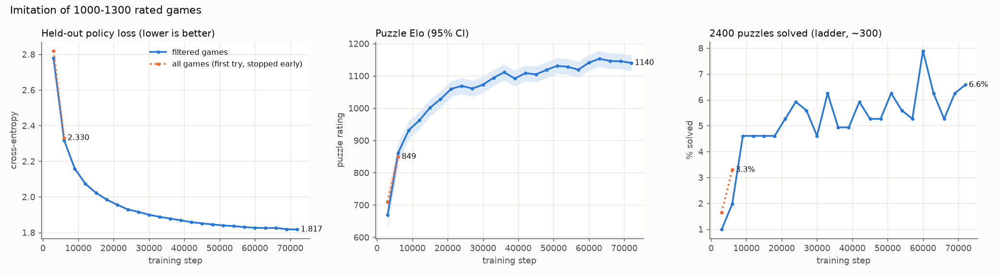
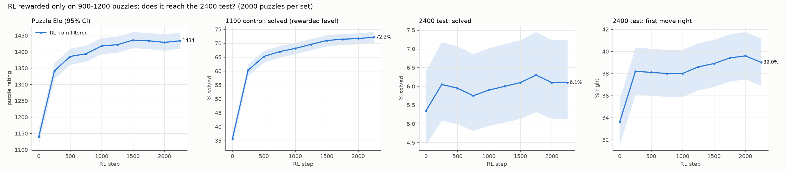

# transcend results

Made by `python transcend/plot_results.py` from `runs/transcend/*_log.jsonl`.

## imitation

| run | last step | held-out loss | puzzle Elo (95% CI) | 1100 solved | 2400 solved |
| --- | --: | --: | --- | --: | --: |
| filtered games (`imitation-clean`) | 72000 | 1.817 | 1140 (1116-1164) | 37.3% | 6.58% |
| all games (first try, stopped early) (`imitation`) | 6000 | 2.330 | 849 (818-880) | 9.8% | 3.29% |

## RL on 900-1200 puzzles

| run | metric | step 0 | latest | change | 95% CI at latest |
| --- | --- | --: | --: | --: | --- |
| RL from filtered | puzzle Elo | 1140 | 1434 (step 2250) | +294 | 1410-1459 |
| RL from filtered | 1100 solved | 35.6% | 72.2% | +36.5 pts | 70.1-74.1% |
| RL from filtered | 2400 solved | 5.3% | 6.1% | +0.8 pts | 5.1-7.2% |
| RL from filtered | 2400 first move | 33.6% | 39.0% | +5.4 pts | 36.9-41.2% |

The rl-clean log up to step 2250 was rebuilt from the console output; its first-move counts come from the printed percentages (to 0.1%).

## figures

